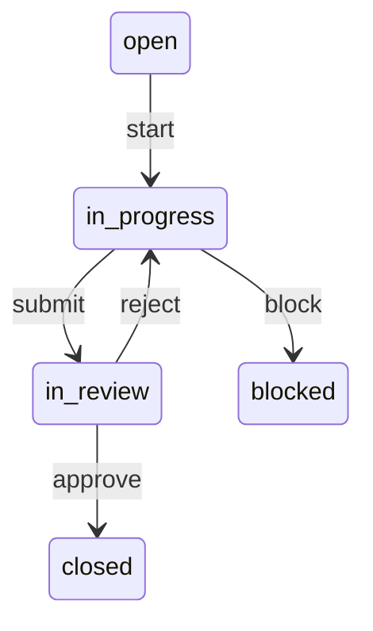

# Overview

Use `td` to:

- Know what work to complete
- Track and Navigate work dependencies
- Track progress and decisions
- Discover relevant context for resuming work

When your session ends, use `td` to capture:

- work completed
- work remaining
- decisions made

This provides the next session with what it needs to continue.

**Core capability:** Run `td usage` and get everything needed for the next action:

- current focus
- pending reviews
- open issues
- recent decisions

## Goal

Perform work as described by assigned tasks and track progress and decisions until a task is "closed."

### Patterns

**ALWAYS** apply these patterns when the situation calls for it:

1. **Always start with `td usage --new-session`** - Tells you current focus, pending reviews, and what to work on
2. **Handoff before context ends** - Don't let context window expire without handoff
3. **Use work sessions for related issues** - Groups handoffs and makes tracking easier
4. **Check blockers vs openwork** - If blocked, don't waste tokens retrying - work on something else
5. **Log Progress**:
   - **Log decisions** → Use `--decision` flag to mark decisions
   - **Log uncertainty** → Use `--uncertain` flag to mark unknowns
   - **Log log attempted approach** → Use `--tried` flag to mark unknowns
   - **Log hypothesis** → Use `--hypothesis` flag to mark hypotheses
   - **Log results** → Use `--result` flag to mark results of an approach
6. **Track files** → Use `td link` so future sessions know what changed
7. **Link reference** → Use `td link` to link task to files for reference purposes, like associated specs, docs,
   rules, or code

## Workflow

### When starting work

Get highest priority open issue : `td next`
Determine what unblocks most work: `td critical-path`

- [Signle issue workflow](./references/single-issue.md)
- [Multi issue workflow](./references/multi-issue.md)

**ALWAYS** apply these patterns for the common workflows and scenarios you'll encounter.
**IMPORTANT**: only refer to linked documents for the workflow relevant to your current progress.

- delegating work or ending a session: [reference](./references/worfklows/handing-off-work.md)
- reviewing work: [reference](./references/worfklows/reviewing-work.md)
- handling blockers: [reference](./references/worfklows/handling-blockers.md)

See [quick reference](./references/quick_reference.md) for a summary of common commands.
