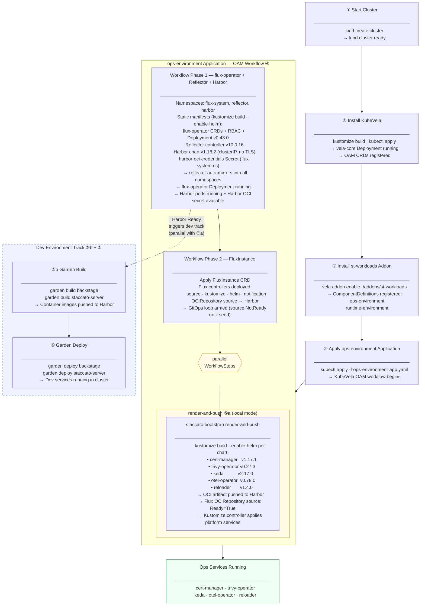

# Cluster Bootstrap — Desired State

> **Purpose:** Authoritative reference for the end-to-end bootstrap sequence that brings a Staccato
> Toolkit cluster from bare metal to a fully operational dev environment.  
> Gaps are called out explicitly at the bottom; they do not block the desired state model.

---

## Bootstrap Sequence

---

## Step Reference

| Step      | Label                             | Mechanism                                                                        | Depends on                     |
| --------- | --------------------------------- | -------------------------------------------------------------------------------- | ------------------------------ |
| ①         | Start Cluster                     | `kind create cluster`                                                            | —                              |
| ②         | Install KubeVela                  | `kustomize build \| kubectl apply`                                               | ①                              |
| ③         | Install st-workloads Addon        | `vela addon enable ./addons/st-workloads`                                        | ②                              |
| ④         | Apply ops-environment Application | `kubectl apply -f ops-environment-app.yaml`                                      | ③                              |
| ④ W1      | flux-operator + Reflector + Harbor | OAM Workflow Phase 1 — static manifests (kustomize rendered, committed)         | ④                              |
| ④ W1 auth | Declarative Harbor OCI secret      | Creates `harbor-oci-credentials` in `flux-system` and reflects it cluster-wide  | W1                             |
| ④ W2      | FluxInstance                      | OAM Workflow Phase 2 — OCI source wired to Harbor                                | W1                             |
| **⑤a**    | **render-and-push**               | `staccato bootstrap render-and-push` — renders charts, pushes OCI to Harbor      | W1 (Harbor ready)              |
| **⑤b**    | **Garden build** (dev only)       | `garden build backstage staccato-server`                                         | W1 (Harbor) — parallel with ⑤a |
| **⑥**     | **Garden deploy** (dev only)      | `garden deploy backstage staccato-server`                                        | ⑤b                             |

---

## Color Legend

| Color                      | Meaning                                                     |
| -------------------------- | ----------------------------------------------------------- |
| Amber border (——)          | OAM WorkflowStep inside the ops-environment Application     |
| Blue dashed border (- - -) | Dev-environment-only track; not part of the OAM Application |
| Green fill                 | Terminal ops-services steady state                          |

---

## Gap Analysis

All gaps identified in the original gap analysis have been resolved or formally deferred.
See commit history for individual fix details.

### Resolved

| ID  | Gap                                                               | Resolution                                                                      |
| --- | ----------------------------------------------------------------- | ------------------------------------------------------------------------------- |
| B1  | `assets/addons/` embed directive references missing directory     | Removed `assets/addons` from `core/bootstrap.go` embed — Harbor is in st-workloads |
| B2  | `ops-environment` Garden action does not exist                    | Already implemented at `.st/environments/garden.yaml`                           |
| B3  | Harbor addon not implemented                                      | Harbor rendered into `st-workloads/template.yaml` via `kustomization.yaml`      |
| B4  | `task: vela:up` dead reference                                    | Fixed: `task: control-plane-orch:up`                                            |
| S1  | Bootstrap CLI references `st-environment` not `st-workloads`     | CLI updated: `init` now enables `st-workloads` directly                         |
| S2  | `ops-environment.cue` passes no charts                           | Charts field wired; defaults populated in `ops-environment.cue`                 |
| S3  | Harbor not managed by OAM workflow                               | Harbor in Phase 1 of st-workloads alongside flux-operator                       |
| S4  | `cluster:up` uses `kind`                                          | Intentional for local dev — k0s migration deferred                              |
| Q1  | FluxInstance applied before Harbor is running                     | Harbor in Phase 1; FluxInstance in Phase 2 — sequencing enforced by OAM         |
| Q2  | `render-and-push` not called before FluxInstance sync begins     | Added to `dev:up:ops-environment` with Harbor readiness wait                    |
| Q3  | Harbor credentials not injected before bootstrap                  | harbor-core initContainer creates both secrets on pod startup                   |
| P1  | `ops-environment` Garden Deploy action                            | Already implemented at `.st/environments/garden.yaml`                           |
| P2  | Harbor KubeVela addon (`assets/addons/harbor/`)                   | Superseded: Harbor in st-workloads kustomization                                |
| P3  | `ops-environment.cue` chart list populated                        | Five platform charts with pinned versions in `ops-environment.cue` + `env.yaml` |
| P4  | Harbor OAM Workflow Phase                                         | Harbor in Phase 1 of st-workloads template                                      |
| P5  | `render-and-push` wired into `dev:up:ops-environment`            | Wired with Harbor readiness gate in Taskfile                                    |
| P6  | Harbor credential injection                                       | harbor-core initContainer                                                       |
| P7  | Garden Deploy actions for backstage and staccato-server           | Already implemented in respective `garden.yml` files                            |

### Deferred

| ID  | Gap                                                               | Deferred Until                                          |
| --- | ----------------------------------------------------------------- | ------------------------------------------------------- |
| S5/P8 | render-manifests production mode (git → Harbor proxy)          | Local mode validated end-to-end; see `render-manifests.cue` TODO(production) |
